# kiss deployer

Automatic Deployer Platform for Safu contracts on ethereum mainnet, Arbitrum One and bsc testnet

```
https://kissdeployer.app/
```

# deployed addresses
## ethereum mainnet
```
chain id 1

deployer
https://etherscan.io/address/0x4e15f5E627B030De03fA59c21DD8694C9ECf6A38

locker
https://etherscan.io/address/0xcA76E72d9F5A92f50A8B3B2B1205Fe8dc7b72730

router
https://etherscan.io/address/0x7a250d5630B4cF539739dF2C5dAcb4c659F2488D
```

## bsc testnet
```
chain id 97

deployer
https://testnet.bscscan.com/address/0xA538cA96b191B96d31B2Fea00fB85fA6e0874b89

locker
https://testnet.bscscan.com/address/0x66a10d561f2A9E0Fa77FC650a88e0881121119c1

router
https://testnet.bscscan.com/address/0x1Ed675D5e63314B760162A3D1Cae1803DCFC87C7
```

## Arbitrum One
```
chain id 42161

locker
https://arbiscan.io/address/0x4e15f5E627B030De03fA59c21DD8694C9ECf6A38

router
https://arbiscan.io/address/0x1b02dA8Cb0d097eB8D57A175b88c7D8b47997506
```

## Dashboard
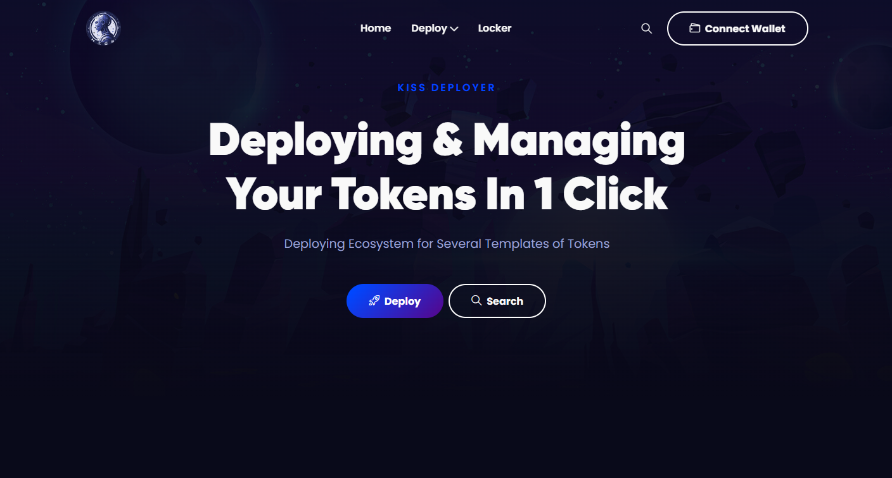

## Connect Wallet
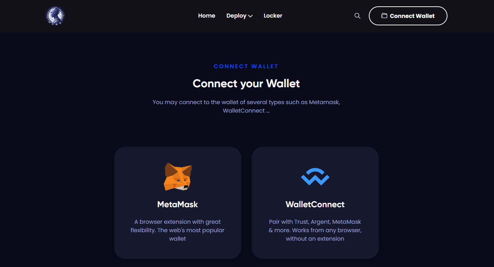

## Template Show
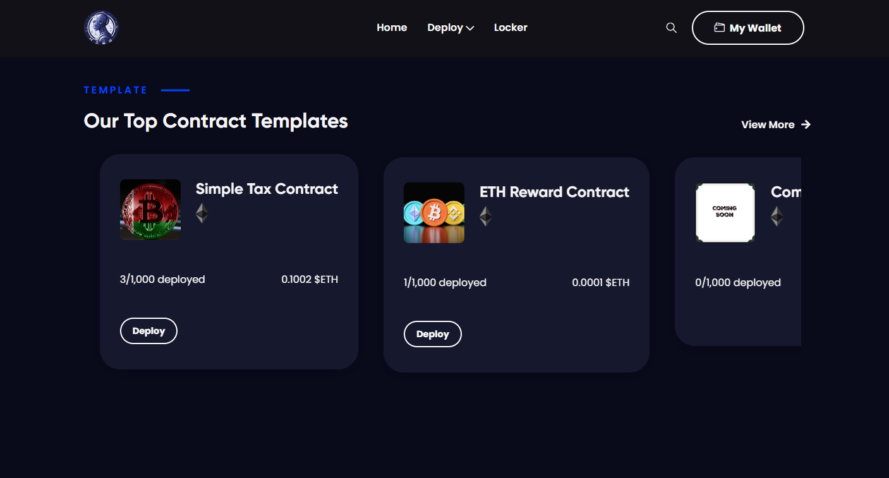

## Deployed History
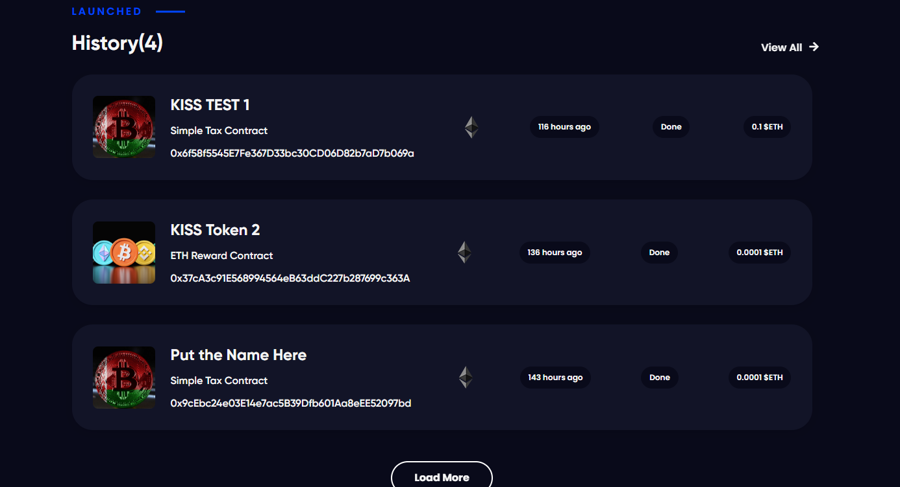

## Explanation
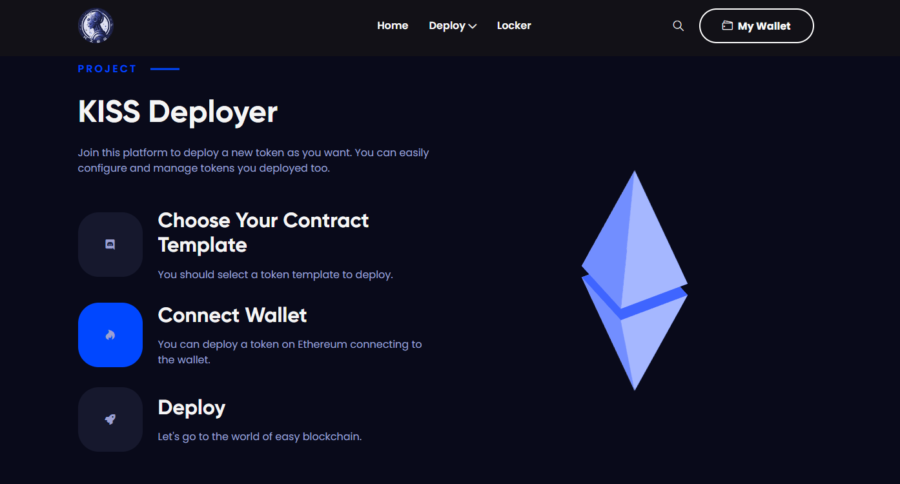

## Footer
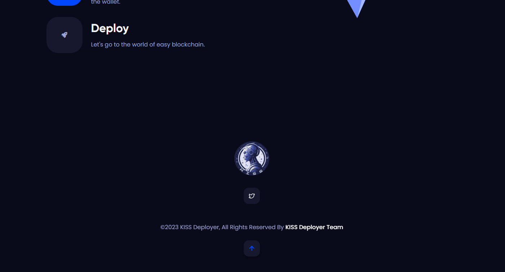

## Template 1
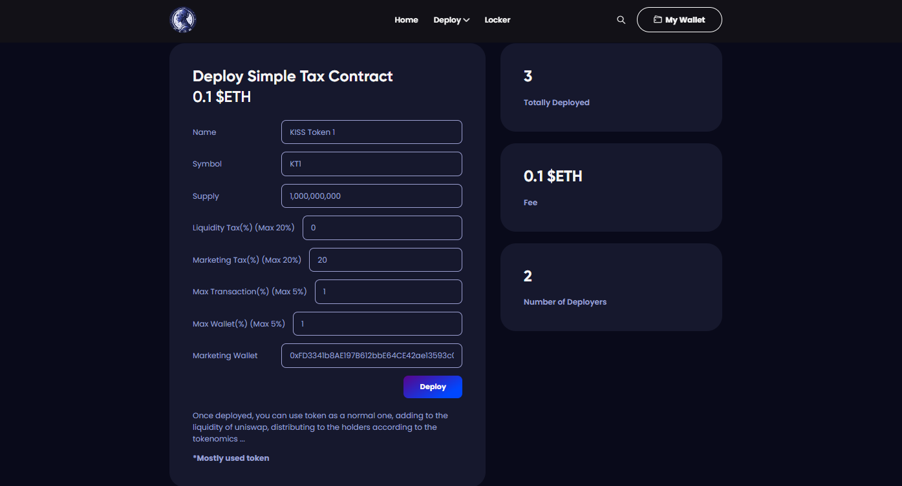

## Template 2
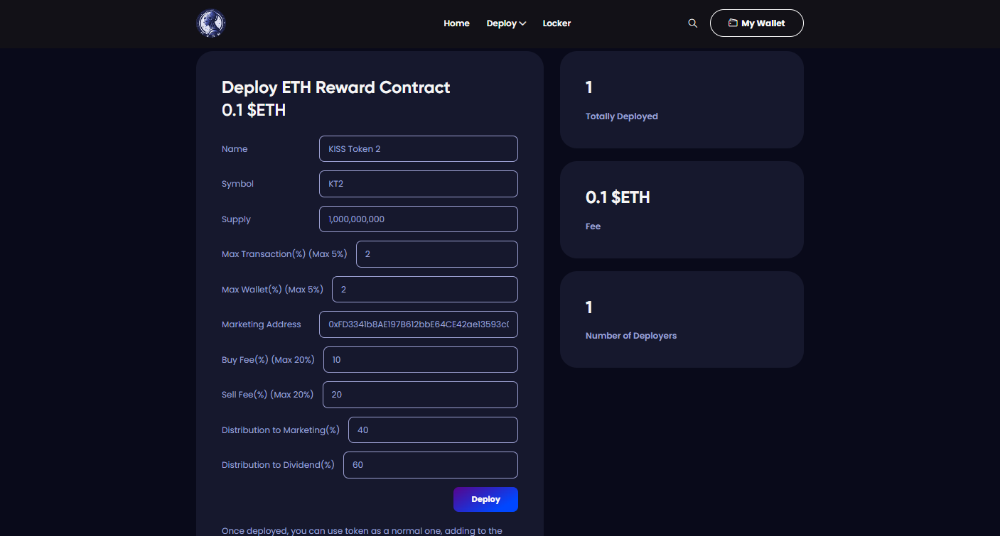

## Admin Page
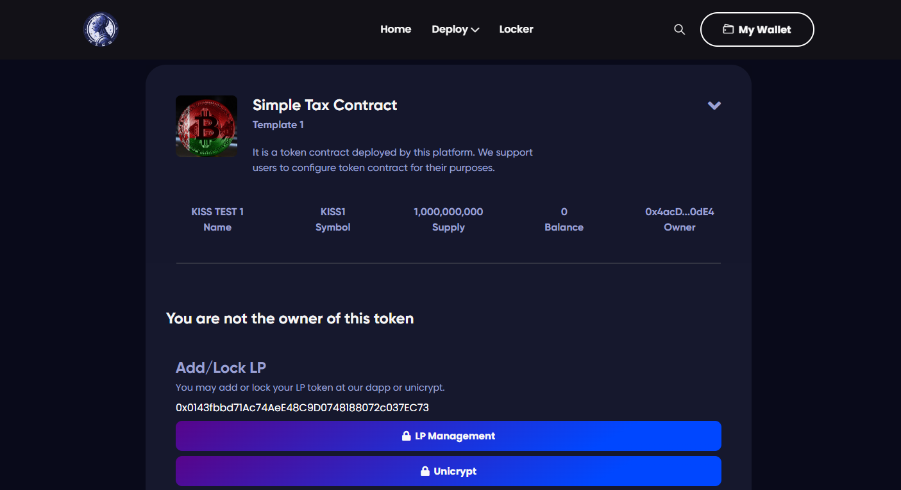

## Add To LP & Lock
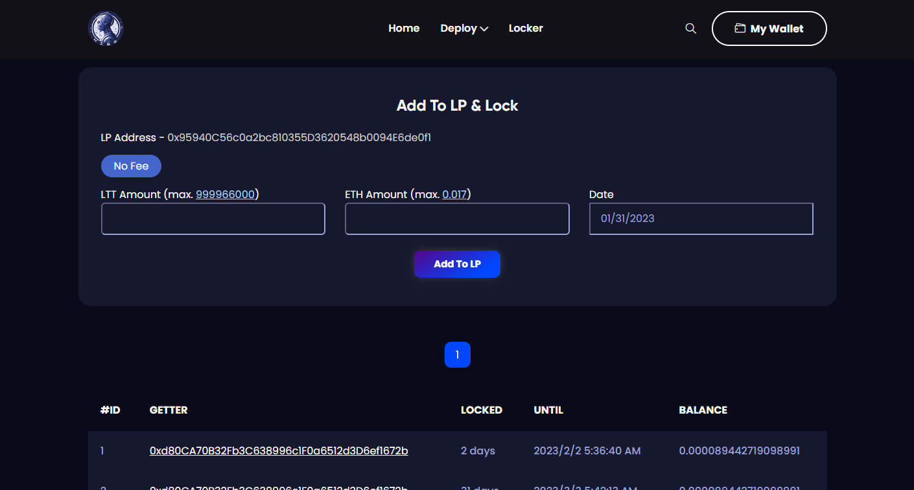

## Lock LP
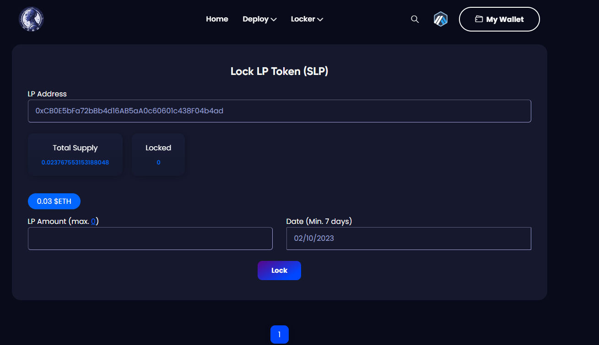